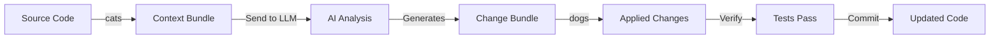

# PAWS: Prepare Artifacts With SWAP

**Multi-Agent AI Orchestration with Consensus-Based Verification**

[](https://opensource.org/licenses/MIT)
[](https://www.python.org/downloads/)
[](https://nodejs.org/)

## What Makes PAWS Different

PAWS does things other AI coding tools can't:

☇ **Swarm Intelligence**: Run 3-5 LLMs in parallel (GPT-4, Claude, Gemini) and let them compete. Best solution wins.

⚬ **Deterministic Execution**: Version-lock models + explicit context bundles = same input, same output. Reproducible across teams.

♃ **Performance Benchmarking**: Track which AI model performs best on YOUR codebase with real metrics.

☉ **Massive Context Handling**: Refactor 500K+ line codebases through hierarchical chunking and CATSCAN summaries.

⚘ **Test-Driven Consensus**: Solutions run in isolated git worktrees. Only changes that pass your test suite are presented.

♲ **Editor-Agnostic**: Works with vim, VSCode, Emacs, IntelliJ - any editor. CLI-first design.

**Where PAWS Excels:** Large refactors, critical production changes, reproducible team workflows, multi-model verification

**Where Others Excel:** Cursor has better inline editing. Claude Code has better IDE integration. Copilot has faster autocomplete.

## Quick Start

```bash
# 1. Bundle context for AI with smart curation
python py/cats.py --ai-curate "refactor auth to use OAuth2" -o context.md

# 2. Run multi-agent competition with test verification
python py/paws_paxos.py \
  "Refactor auth module to OAuth2" \
  context.md \
  --verify-cmd "pytest tests/test_auth.py"

# 3. Review winning solutions interactively
python py/dogs.py workspace/competition/gemini_solution.dogs.md --interactive

# 4. Benchmark performance across models
python py/paws_benchmark.py context.md --models gemini,claude,gpt4
```

## Core Tools

**cats** - Context bundler with AI-powered file selection
- Bundles source files into LLM-friendly markdown
- AI curates relevant files based on task description
- Supports personas and system prompts

**dogs** - Change applier with interactive review
- Extracts file changes from LLM responses
- Visual diffs with selective approval
- Git-based verification and automatic rollback

**paws_paxos** - Multi-agent orchestrator
- Runs 3-5 LLMs in parallel on the same task
- Isolated git worktrees for each solution
- Test-driven consensus voting
- Only passing solutions presented

**paws_benchmark** - Performance analyzer (NEW)
- Compare LLM performance on your codebase
- Track metrics: speed, correctness, token efficiency
- Generate comparative reports

**paws_swarm** - Swarm intelligence coordinator (NEW)
- Agents collaborate in real-time, not just compete
- Hierarchical task decomposition
- Consensus through multi-round voting


## Installation

```bash
# Clone the repository
git clone https://github.com/yourusername/paws.git
cd paws

# Install Python dependencies
pip install google-generativeai anthropic openai rich

# Or for JavaScript
npm install

# Test it out
python py/cats.py --help
python py/paws_paxos.py --help
```

**What you get:**
- `cats.py` - Context bundler with AI curation
- `dogs.py` - Interactive change applier
- `paws_paxos.py` - Multi-agent competition orchestrator ☇
- `paws_swarm.py` - Collaborative swarm intelligence ♲
- `paws_benchmark.py` - Performance comparison system ♃
- `paws_context_optimizer.py` - Massive codebase handler ☉

## Core Concepts

### The PAWS Philosophy

PAWS operates on three principles:

1. **Context is King** - Controlling what the AI sees controls what it produces
2. **Reproducibility Matters** - Every workflow should be version-controlled and re-runnable
3. **Human-in-the-Loop** - AI proposes, humans approve and apply

### Workflow Overview



### Core Tools

- **cats** - Context Artifacts Tool for SWAP
  - Bundles source files into LLM-friendly markdown
  - Supports AI-powered file curation
  - Prepends personas and system prompts

- **dogs** - Document Output Generation System
  - Extracts file changes from LLM responses
  - Interactive review with visual diffs
  - Automatic verification and rollback

- **paws-session** - Session Management
  - Git worktree-based isolation
  - Turn-by-turn change tracking
  - Rewind, merge, and archive capabilities

## Usage

### Basic Context Bundling

```bash
# Bundle specific files
cats src/auth.js src/db.js -o auth-context.md

# Bundle with pattern matching
cats "src/**/*.py" -o backend.md

# Add a persona for the AI
cats src/ -o context.md --persona personas/p_refactor.md

# AI-curated context (requires API key)
cats . --ai-curate "Fix authentication bugs" \
  --ai-provider gemini \
  --ai-key $GEMINI_API_KEY
```

### Interactive Change Application

```bash
# Interactive review mode (recommended)
dogs changes.md --interactive

# Auto-apply all changes
dogs changes.md --yes

# Apply with verification
dogs changes.md --verify "npm test" --revert-on-fail
```

### Session Management

```bash
# Create a new isolated session
paws-session start "feature-user-profiles"

# Work in the session workspace
cd .paws/sessions/<session-id>/workspace

# List all sessions
paws-session list

# View session details with TUI
paws-session show <session-id> --interactive

# Rewind to a previous turn
paws-session rewind <session-id> --to-turn 3

# Merge session back to main branch
paws-session merge <session-id>

# Archive without merging
paws-session archive <session-id>
```

## Advanced Workflows

### Multi-Agent Competitive Verification (Paxos)

The Paxos orchestrator runs multiple AI agents in parallel and uses automated verification to achieve consensus on the best solution.

**How It Works:**

1. **Propose** - Multiple agents (Gemini, Claude, GPT-4) independently solve the task
2. **Verify** - Each solution runs in an isolated git worktree with your test suite
3. **Decide** - Only solutions that pass verification are presented to you

```bash
# Run competitive verification
python py/paws_paxos.py \
  "Implement rate limiting in the API" \
  api-context.md \
  --verify-cmd "pytest tests/test_api.py" \
  --config paxos_config.json

# Review winning solutions
ls workspace/competition/

# Apply the best solution
dogs workspace/competition/gemini_solution.dogs.md -i
```

**Configuration** (`paxos_config.json`):

```json
{
  "competitors": [
    {
      "name": "gemini-pro",
      "model_id": "gemini-pro-1.5",
      "persona": "personas/p_gemini_coder.md"
    },
    {
      "name": "claude-3",
      "model_id": "claude-3-opus",
      "persona": "personas/p_claude_coder.md"
    },
    {
      "name": "gpt-4",
      "model_id": "gpt-4-turbo",
      "persona": "personas/p_gpt4_coder.md"
    }
  ]
}
```

**When to Use Paxos:**

| Use Single-Agent | Use Paxos |
|---|---|
| Simple, well-defined tasks | Complex or ambiguous requirements |
| Fast iteration needed | Correctness is critical |
| Budget-conscious | Have test coverage |
| Clear implementation path | Uncertain best approach |

### AI-Powered Context Curation

Let AI select the most relevant files for your task:

```bash
# Gemini curation
cats . --ai-curate "Add user authentication" \
  --ai-provider gemini \
  --max-files 10

# Claude curation
cats . --ai-curate "Optimize database queries" \
  --ai-provider claude \
  --ai-key $ANTHROPIC_API_KEY

# OpenAI curation
cats . --ai-curate "Fix memory leaks" \
  --ai-provider openai
```

### Hierarchical Personas

PAWS includes a suite of cognitive personas that scale AI complexity to match your task:

```bash
# Simple execution
cats src/ -p personas/sys_h1.md  # The Line - direct execution

# Adversarial deliberation
cats src/ -p personas/sys_h2.md  # The Plane - trade-off analysis

# Multi-perspective review
cats src/ -p personas/sys_h3.md  # The Cube - critical review

# Hierarchical strategy
cats src/ -p personas/sys_h4.md  # The Tesseract - complex planning
```

### CATSCAN Documentation

Enforce documentation quality with CATSCAN files:

```bash
# Require CATSCAN files for all modules
cats src/ --strict-catscan

# Warn if README changed without CATSCAN update
dogs changes.md --verify-docs
```

## Architecture

### Project Structure

```
paws/
├── js/                      # JavaScript implementation
│   ├── cats.js             # Context bundler
│   ├── dogs.js             # Change applier
│   ├── paws-session.js     # Session manager
│   └── README.md           # JS-specific docs
├── py/                      # Python implementation
│   ├── cats.py             # Context bundler
│   ├── dogs.py             # Change applier
│   ├── paws_session.py     # Session manager
│   ├── paws_paxos.py       # Paxos orchestrator
│   └── README.md           # Python-specific docs
├── personas/                # AI persona definitions
│   ├── sys_h1.md           # The Line (single-agent)
│   ├── sys_h2.md           # The Plane (adversarial)
│   ├── sys_h3.md           # The Cube (deliberative)
│   ├── sys_h4.md           # The Tesseract (hierarchical)
│   ├── sys_h5.md           # The Penteract (meta-system)
│   └── p_*.md              # Task-specific personas
├── sys/                     # System protocols
│   ├── sys_a.md            # Default protocol
│   ├── sys_d.md            # Delta mode
│   └── sys_r.md            # RSI protocol
├── package.json             # Node.js config
├── requirements.txt         # Python config
└── README.md                # This file
```

### Design Principles

1. **Transparency** - Every decision is visible and auditable
2. **Composability** - Tools chain together for complex workflows
3. **Safety** - Git-backed operations with automatic rollback
4. **Reproducibility** - Same input → same output
5. **Flexibility** - Works with any LLM, any editor, any workflow

## Documentation

- **[Python Documentation](py/README.md)** - Python-specific guide
- **[JavaScript Documentation](js/README.md)** - JavaScript-specific guide
- **[Persona Guide](personas/README.md)** - Creating custom personas
- **[System Protocols](sys/README.md)** - Protocol documentation

## Honest Comparison

### vs. Cursor / Claude Code / Windsurf

| What They Do Better | What PAWS Does Better |
|---------------------|----------------------|
| Real-time inline editing | Multi-agent consensus voting |
| Low-latency autocomplete | Deterministic, reproducible results |
| Seamless IDE integration | Massive context handling (500K+ lines) |
| Better UX for daily coding | Test-driven verification with rollback |
| Faster iteration loops | Performance benchmarking across models |
| | Works with any editor (vim, emacs, VSCode) |

**Use Them For:** Daily development, quick fixes, exploratory coding

**Use PAWS For:** Critical refactors, production changes, team workflows needing reproducibility

### vs. GitHub Copilot / Codex

| What They Do Better | What PAWS Does Better |
|---------------------|----------------------|
| Instant suggestions | Full-file context awareness |
| Trained on more code | Explicit context control |
| Fast autocomplete | Multi-model competition |
| Better IDE integration | Test suite integration |
| | Git worktree isolation |

### vs. Gemini CLI / Claude CLI

| What They Do Better | What PAWS Does Better |
|---------------------|----------------------|
| Simpler to use | Structured workflows |
| Direct API access | Context bundling with personas |
| Conversational | Automated verification |
| | Multi-agent orchestration |
| | Session management with git |

## Revolutionary Features in Action

### 1. Multi-Agent Competition (Paxos)

Run 3 different LLMs in parallel, let them compete, only present solutions that pass your tests:

```bash
# Create optimized context
python py/cats.py --ai-curate "refactor auth to OAuth2" -o context.md

# Run competition between GPT-4, Claude, and Gemini
python py/paws_paxos.py \
  "Refactor authentication to use OAuth2" \
  context.md \
  --verify-cmd "pytest tests/test_auth.py"

# Only passing solutions are presented
# Review the best one
python py/dogs.py workspace/competition/claude-sonnet_solution.dogs.md --interactive
```

**Why this is revolutionary:** Cursor and Claude Code can only use one model at a time. PAWS runs 3-5 in parallel with test-driven consensus.

### 2. Swarm Intelligence (Collaborative Agents)

Unlike competition, swarm enables agents to collaborate with specialized roles:

```bash
# Architect decomposes, Implementers code, Reviewers critique
python py/paws_swarm.py \
  "Implement a new caching layer with Redis" \
  context.md

# Agents collaborate through multiple rounds:
# Round 1: Architect breaks down task
# Round 2: Implementer proposes solution
# Round 3: Reviewer critiques
# Round 4: Implementer revises
```

**Why this is revolutionary:** Other tools are single-agent. PAWS agents have roles and collaborate like a real team.

### 3. Performance Benchmarking

Track which LLM actually performs best on YOUR codebase:

```bash
# Compare models on real tasks
python py/paws_benchmark.py \
  --task "Fix memory leak in worker pool" \
  --context context.md \
  --verify-cmd "pytest tests/test_memory.py"

# Get detailed metrics:
# - Pass rate
# - Execution speed
# - Token efficiency
# - Cost per solution
```

**Why this is revolutionary:** No other tool tracks LLM performance with real metrics on your specific codebase.

### 4. Massive Context Optimization

Refactor 500K+ line codebases through smart context windowing:

```bash
# Optimize context for large codebase
python py/paws_context_optimizer.py \
  "Migrate from Flask to FastAPI" \
  --scan backend/ \
  --max-tokens 100000 \
  --output optimized_context.md

# Context optimizer:
# - Analyzes dependencies
# - Includes core files in full
# - Summarizes related files with CATSCAN
# - Fits in model context window

# Use optimized context with any tool
python py/paws_paxos.py \
  "Migrate from Flask to FastAPI" \
  optimized_context.md \
  --verify-cmd "pytest"
```

**Why this is revolutionary:** Other tools hit context limits on large refactors. PAWS uses hierarchical summarization.

## Performance & Cost

### Token Efficiency

CATSCAN files dramatically reduce token usage:

- **Full implementation:** ~10,000 tokens
- **CATSCAN summary:** ~500 tokens
- **Savings:** 95% reduction

### Paxos Cost Analysis

Example task with 3 agents:

- Single agent: ~$0.05, 70% success rate
- Paxos (3 agents): ~$0.15, 95% success rate
- **Net benefit:** 3x cost, 1.35x reliability

## Contributing

We welcome contributions! Please see our contributing guidelines:

1. **Bug Reports** - Open an issue with reproduction steps
2. **Feature Requests** - Describe the use case and proposed solution
3. **Pull Requests** - Fork, create a branch, and submit a PR
4. **Documentation** - Help improve our docs and examples

### Development Setup

```bash
# Clone repository
git clone https://github.com/yourusername/paws.git
cd paws

# Python development
python -m venv venv
source venv/bin/activate
pip install -r requirements.txt
python -m pytest py/tests/

# JavaScript development
npm install
npm test
```

## License

MIT License - see [LICENSE](LICENSE) file for details.

## Related Projects

**[REPLOID](https://github.com/clocksmith/reploid)** - A browser-native implementation of the PAWS philosophy with visual Guardian Agent interface, git worktree session management, and Paxos-based competitive verification. Perfect for developers who prefer a visual UI over CLI tools. Try it at [replo.id](https://replo.id).

## Acknowledgments

PAWS builds on ideas from:
- **Paxos consensus protocol** - Multi-agent verification
- **Git worktrees** - Isolated workspaces
- **UNIX philosophy** - Composable tools that do one thing well

## Support

- **Issues:** [GitHub Issues](https://github.com/yourusername/paws/issues)
- **Discussions:** [GitHub Discussions](https://github.com/yourusername/paws/discussions)
- **Documentation:** [Full Docs](https://paws.dev/docs)

---

**Made by developers who believe AI should empower, not replace, human judgment.**
