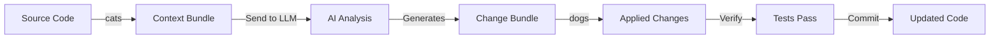

# PAWS: Prepare Artifacts With SWAP

**Streamlined Write After PAWS** - A programmable AI workflow system for controlled LLM interactions

[](https://opensource.org/licenses/MIT)
[](https://www.python.org/downloads/)
[](https://nodejs.org/)

## Overview

PAWS is a powerful CLI toolkit that puts developers in control of AI-assisted development by making context explicit and workflows reproducible. Unlike AI-integrated IDEs that abstract away context selection, PAWS gives you surgical precision over what the AI sees and how it operates.

**The Problem:** AI tools are powerful but often opaque - you don't know what context they're using or how to reproduce results.

**The Solution:** PAWS makes AI workflows transparent, reproducible, and composable through explicit context bundling and structured change proposals.

## Table of Contents

- [Key Features](#key-features)
- [Quick Start](#quick-start)
- [Installation](#installation)
- [Core Concepts](#core-concepts)
- [Usage](#usage)
- [Advanced Workflows](#advanced-workflows)
- [Architecture](#architecture)
- [Documentation](#documentation)
- [Contributing](#contributing)
- [License](#license)

## Key Features

### ☉ Explicit Context Control
- **cats** tool bundles exactly the files you choose into a portable `.md` format
- AI-powered file curation can automatically select relevant files for your task
- Perfect for token efficiency - only send what matters

### ♲ Interactive Change Management
- **dogs** tool extracts and applies code changes with human approval
- Beautiful TUI with visual diffs and selective file approval
- Git-based verification with automatic rollback on test failures

### ☿ Git-Backed Safety
- **paws-session** manages isolated git worktrees for each workflow
- Track every change as a git commit
- Rewind to any point in history
- Merge or archive completed sessions

### ⚘ Multi-Agent Competitive Verification (Paxos)
- Run multiple AI agents in parallel on the same task
- Automatic verification of each solution in isolated environments
- Consensus-based selection - only solutions that pass tests are presented
- Dramatically increases reliability for complex tasks

### ☇ Dual Implementation
- **Python** and **JavaScript** versions with identical CLI interfaces
- Choose your preferred language ecosystem
- Feature parity across both implementations

### ⚛ Rich Developer Experience
- Interactive TUI with blessed/blessed-contrib
- Colored terminal output with chalk
- Progress spinners and status indicators
- Session management dashboard

## Quick Start

```bash
# Python - Bundle project files for AI
python py/cats.py src/ -o context.md

# JavaScript - Apply changes with interactive review
node js/dogs.js changes.md --interactive

# Start a session for isolated work
node js/paws-session.js start "refactor-auth"

# Run competitive verification with multiple agents
python py/paws_paxos.py \
  "Refactor the auth module" \
  context.md \
  --verify-cmd "pytest tests/"
```

## Installation

### Python Version

```bash
# Clone the repository
git clone https://github.com/yourusername/paws.git
cd paws

# Install Python dependencies (optional - core works without deps)
pip install -r requirements.txt

# Run directly
python py/cats.py --help
```

**Core Python tools have no dependencies!** Optional deps add AI curation and enhanced UI.

### JavaScript Version

```bash
# Install Node.js dependencies
npm install

# Use CLI tools
node js/cats.js --help
node js/dogs.js --help
node js/paws-session.js --help

# Or install globally
npm link
cats --help
```

## Core Concepts

### The PAWS Philosophy

PAWS operates on three principles:

1. **Context is King** - Controlling what the AI sees controls what it produces
2. **Reproducibility Matters** - Every workflow should be version-controlled and re-runnable
3. **Human-in-the-Loop** - AI proposes, humans approve and apply

### Workflow Overview



### Core Tools

- **cats** - Context Artifacts Tool for SWAP
  - Bundles source files into LLM-friendly markdown
  - Supports AI-powered file curation
  - Prepends personas and system prompts

- **dogs** - Document Output Generation System
  - Extracts file changes from LLM responses
  - Interactive review with visual diffs
  - Automatic verification and rollback

- **paws-session** - Session Management
  - Git worktree-based isolation
  - Turn-by-turn change tracking
  - Rewind, merge, and archive capabilities

## Usage

### Basic Context Bundling

```bash
# Bundle specific files
cats src/auth.js src/db.js -o auth-context.md

# Bundle with pattern matching
cats "src/**/*.py" -o backend.md

# Add a persona for the AI
cats src/ -o context.md --persona personas/p_refactor.md

# AI-curated context (requires API key)
cats . --ai-curate "Fix authentication bugs" \
  --ai-provider gemini \
  --ai-key $GEMINI_API_KEY
```

### Interactive Change Application

```bash
# Interactive review mode (recommended)
dogs changes.md --interactive

# Auto-apply all changes
dogs changes.md --yes

# Apply with verification
dogs changes.md --verify "npm test" --revert-on-fail
```

### Session Management

```bash
# Create a new isolated session
paws-session start "feature-user-profiles"

# Work in the session workspace
cd .paws/sessions/<session-id>/workspace

# List all sessions
paws-session list

# View session details with TUI
paws-session show <session-id> --interactive

# Rewind to a previous turn
paws-session rewind <session-id> --to-turn 3

# Merge session back to main branch
paws-session merge <session-id>

# Archive without merging
paws-session archive <session-id>
```

## Advanced Workflows

### Multi-Agent Competitive Verification (Paxos)

The Paxos orchestrator runs multiple AI agents in parallel and uses automated verification to achieve consensus on the best solution.

**How It Works:**

1. **Propose** - Multiple agents (Gemini, Claude, GPT-4) independently solve the task
2. **Verify** - Each solution runs in an isolated git worktree with your test suite
3. **Decide** - Only solutions that pass verification are presented to you

```bash
# Run competitive verification
python py/paws_paxos.py \
  "Implement rate limiting in the API" \
  api-context.md \
  --verify-cmd "pytest tests/test_api.py" \
  --config paxos_config.json

# Review winning solutions
ls workspace/competition/

# Apply the best solution
dogs workspace/competition/gemini_solution.dogs.md -i
```

**Configuration** (`paxos_config.json`):

```json
{
  "competitors": [
    {
      "name": "gemini-pro",
      "model_id": "gemini-pro-1.5",
      "persona": "personas/p_gemini_coder.md"
    },
    {
      "name": "claude-3",
      "model_id": "claude-3-opus",
      "persona": "personas/p_claude_coder.md"
    },
    {
      "name": "gpt-4",
      "model_id": "gpt-4-turbo",
      "persona": "personas/p_gpt4_coder.md"
    }
  ]
}
```

**When to Use Paxos:**

| Use Single-Agent | Use Paxos |
|---|---|
| Simple, well-defined tasks | Complex or ambiguous requirements |
| Fast iteration needed | Correctness is critical |
| Budget-conscious | Have test coverage |
| Clear implementation path | Uncertain best approach |

### AI-Powered Context Curation

Let AI select the most relevant files for your task:

```bash
# Gemini curation
cats . --ai-curate "Add user authentication" \
  --ai-provider gemini \
  --max-files 10

# Claude curation
cats . --ai-curate "Optimize database queries" \
  --ai-provider claude \
  --ai-key $ANTHROPIC_API_KEY

# OpenAI curation
cats . --ai-curate "Fix memory leaks" \
  --ai-provider openai
```

### Hierarchical Personas

PAWS includes a suite of cognitive personas that scale AI complexity to match your task:

```bash
# Simple execution
cats src/ -p personas/sys_h1.md  # The Line - direct execution

# Adversarial deliberation
cats src/ -p personas/sys_h2.md  # The Plane - trade-off analysis

# Multi-perspective review
cats src/ -p personas/sys_h3.md  # The Cube - critical review

# Hierarchical strategy
cats src/ -p personas/sys_h4.md  # The Tesseract - complex planning
```

### CATSCAN Documentation

Enforce documentation quality with CATSCAN files:

```bash
# Require CATSCAN files for all modules
cats src/ --strict-catscan

# Warn if README changed without CATSCAN update
dogs changes.md --verify-docs
```

## Architecture

### Project Structure

```
paws/
├── js/                      # JavaScript implementation
│   ├── cats.js             # Context bundler
│   ├── dogs.js             # Change applier
│   ├── paws-session.js     # Session manager
│   └── README.md           # JS-specific docs
├── py/                      # Python implementation
│   ├── cats.py             # Context bundler
│   ├── dogs.py             # Change applier
│   ├── paws_session.py     # Session manager
│   ├── paws_paxos.py       # Paxos orchestrator
│   └── README.md           # Python-specific docs
├── personas/                # AI persona definitions
│   ├── sys_h1.md           # The Line (single-agent)
│   ├── sys_h2.md           # The Plane (adversarial)
│   ├── sys_h3.md           # The Cube (deliberative)
│   ├── sys_h4.md           # The Tesseract (hierarchical)
│   ├── sys_h5.md           # The Penteract (meta-system)
│   └── p_*.md              # Task-specific personas
├── sys/                     # System protocols
│   ├── sys_a.md            # Default protocol
│   ├── sys_d.md            # Delta mode
│   └── sys_r.md            # RSI protocol
├── package.json             # Node.js config
├── requirements.txt         # Python config
└── README.md                # This file
```

### Design Principles

1. **Transparency** - Every decision is visible and auditable
2. **Composability** - Tools chain together for complex workflows
3. **Safety** - Git-backed operations with automatic rollback
4. **Reproducibility** - Same input → same output
5. **Flexibility** - Works with any LLM, any editor, any workflow

## Documentation

- **[Python Documentation](py/README.md)** - Python-specific guide
- **[JavaScript Documentation](js/README.md)** - JavaScript-specific guide
- **[Persona Guide](personas/README.md)** - Creating custom personas
- **[System Protocols](sys/README.md)** - Protocol documentation

## Why PAWS?

### vs. AI-Integrated IDEs (Cursor, Windsurf)

| Feature | AI IDEs | PAWS |
|---------|---------|------|
| Context | Implicit (automatic) | Explicit (developer-controlled) |
| Reproducibility | Low (UI-based) | High (scriptable CLI) |
| Integration | Locked to IDE | Any editor |
| Extensibility | Plugin system | Native composability |
| Debugging | Opaque | Transparent |

### vs. Direct LLM CLIs (Gemini CLI, Claude CLI)

| Feature | LLM CLIs | PAWS |
|---------|----------|------|
| Workflow | Interactive chat | Structured pipeline |
| Context | File paths only | Rich bundles with personas |
| Safety | Manual review | Automated verification |
| Multi-agent | No | Yes (Paxos) |
| Sessions | No | Full session management |

### vs. Agentic IDEs

| Feature | Agentic IDEs | PAWS |
|---------|--------------|------|
| Autonomy | High (less control) | Balanced (human-in-loop) |
| Transparency | Low | High |
| Cost Control | Automatic | Explicit |
| Test Integration | Built-in | Bring your own |

## Real-World Use Cases

### 1. Refactoring Legacy Code

```bash
# Create context from legacy module
cats legacy/auth_v1.py -o legacy-auth.md

# Add refactoring persona
cats legacy/ -p personas/p_refactor.md -o context.md

# Review proposed changes interactively
dogs refactor-proposal.md --interactive

# Apply with verification
dogs refactor-proposal.md --verify "pytest tests/test_auth.py" --revert-on-fail
```

### 2. Multi-Agent Code Review

```bash
# Get multiple perspectives on the same code
python py/paws_paxos.py \
  "Review this code for security issues" \
  security-context.md \
  --verify-cmd "npm run security-test"
```

### 3. Documentation Generation

```bash
# Bundle source for documentation
cats src/ -p personas/p_documentation.md -o docs-context.md

# Apply generated documentation
dogs docs-proposal.md --verify-docs
```

### 4. Long-Running Experiments

```bash
# Start isolated experiment
paws-session start "experiment-new-algorithm"

# Work in session
cd .paws/sessions/<session-id>/workspace

# Multiple turns of AI assistance
cats . -o context.md && dogs changes.md --interactive

# Decide outcome
paws-session merge <session-id>  # Success!
# or
paws-session archive <session-id>  # Didn't work out
```

## Performance & Cost

### Token Efficiency

CATSCAN files dramatically reduce token usage:

- **Full implementation:** ~10,000 tokens
- **CATSCAN summary:** ~500 tokens
- **Savings:** 95% reduction

### Paxos Cost Analysis

Example task with 3 agents:

- Single agent: ~$0.05, 70% success rate
- Paxos (3 agents): ~$0.15, 95% success rate
- **Net benefit:** 3x cost, 1.35x reliability

## Contributing

We welcome contributions! Please see our contributing guidelines:

1. **Bug Reports** - Open an issue with reproduction steps
2. **Feature Requests** - Describe the use case and proposed solution
3. **Pull Requests** - Fork, create a branch, and submit a PR
4. **Documentation** - Help improve our docs and examples

### Development Setup

```bash
# Clone repository
git clone https://github.com/yourusername/paws.git
cd paws

# Python development
python -m venv venv
source venv/bin/activate
pip install -r requirements.txt
python -m pytest py/tests/

# JavaScript development
npm install
npm test
```

## License

MIT License - see [LICENSE](LICENSE) file for details.

## Related Projects

**[REPLOID](https://github.com/clocksmith/reploid)** - A browser-native implementation of the PAWS philosophy with visual Guardian Agent interface, git worktree session management, and Paxos-based competitive verification. Perfect for developers who prefer a visual UI over CLI tools. Try it at [replo.id](https://replo.id).

## Acknowledgments

PAWS builds on ideas from:
- **Paxos consensus protocol** - Multi-agent verification
- **Git worktrees** - Isolated workspaces
- **UNIX philosophy** - Composable tools that do one thing well

## Support

- **Issues:** [GitHub Issues](https://github.com/yourusername/paws/issues)
- **Discussions:** [GitHub Discussions](https://github.com/yourusername/paws/discussions)
- **Documentation:** [Full Docs](https://paws.dev/docs)

---

**Made by developers who believe AI should empower, not replace, human judgment.**
