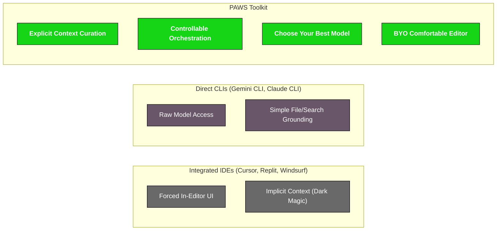

# 🧶🐈 PAWS: Prepare Artifacts With ⚽🐕 SWAP: Streamlined Write After PAWS 🧶🐈⚽🐕

**🐾 PAWS 💱** provides a set of transparent and powerful command-line utilities to bundle your project files for efficient interaction with Large Language Models (LLMs), and then to reconstruct them, enabling a swift code **💱 SWAP 🐾** (Streamlined Write After PAWS).

This repository contains parallel implementations in **Python** and **Node.js**, offering feature parity and a consistent workflow for developers in both ecosystems.

## The PAWS Philosophy: Programmatic AI Orchestration

While AI-integrated IDEs and direct model CLIs offer remarkable capabilities, they often trade control for convenience. Context is frequently implicit, workflows are ephemeral, and the developer is relegated to reacting to the AI's output.

PAWS is engineered for a different paradigm: **the developer as the orchestrator.** It is a foundational toolkit for operators who build bespoke AI systems, providing the essential, unopinionated components to compose, direct, and reproduce an LLM's intelligence with surgical precision. The core principle is that **controlling the context is controlling the outcome.**



This focus on deliberate context curation solves three fundamental challenges in AI-assisted development:

1.  **Token Efficiency & Cost:** `CATSCAN.md` files replace thousands of implementation tokens with a few hundred tokens of a precise contract, enabling larger-scale reasoning at a fraction of the cost.
2.  **Attention Focusing:** It compels the LLM to reason about a module's API surface and dependencies—the critical elements for robust changes—preventing it from getting lost in implementation details.
3.  **Reproducibility & Auditing:** The `cats.md` bundle is a deterministic artifact. The entire AI interaction can be audited, version-controlled, and re-executed reliably.

| Dimension           | AI-Integrated IDE (e.g., Cursor)                                                                              | Gemini CLI                                                                                                             | Windsurf (Agentic IDE Vision)                                                                              | PAWS (Programmatic AI Toolkit)                                                                                                                   |
| :------------------ | :------------------------------------------------------------------------------------------------------------ | :--------------------------------------------------------------------------------------------------------------------- | :--------------------------------------------------------------------------------------------------------- | :----------------------------------------------------------------------------------------------------------------------------------------------- |
| **Primary Goal**    | Augment the developer's inner loop with seamless, in-editor assistance.                                       | Provide direct, conversational access to the Gemini model from the terminal.                                           | Create a true "coding partner" AI that understands high-level intent within the IDE.                       | Provide a **composable toolkit** for developers to orchestrate their own repeatable, multi-turn AI workflows.                                    |
| **Context Control** | **Implicit & Automatic:** Context is derived from open files and the IDE's index. Powerful but can be opaque. | **File-Based & Search-Grounded:** Context is provided via file paths (`@file`) and web search (`@search`) in a prompt. | **Automatic & Holistic:** Aims to understand the entire codebase contextually to perform autonomous tasks. | **Explicit & Developer-Curated:** The developer deterministically builds the _exact_ context bundle (`cats.md`), ensuring focus.                 |
| **Workflow**        | **Conversational & Manual:** The AI is a reactive chat partner within a graphical interface.                  | **Interactive Agent or Single-Shot:** Can be used as a chat agent or for single, non-interactive command execution.    | **Autonomous Agentic Tasks:** Designed for complex, multi-step operations with less human input.           | **Scriptable & Orchestrated:** As a CLI tool, PAWS is natively designed to be scripted and chained into larger, automated, multi-turn workflows. |
| **Extensibility**   | Bound by the host IDE's plugin architecture.                                                                  | Open-source with support for custom extensions and tools via the Model Context Protocol (MCP).                         | Primarily a closed, integrated product vision (though parts may be open).                                  | **Natively Composable:** Can be combined with any script, persona, or context source, offering limitless workflow design.                        |
| **Reproducibility** | Low: UI-based conversations are difficult to reproduce exactly.                                               | Moderate: Single-shot commands are reproducible, but interactive sessions are less so.                                 | Low: Complex agentic behaviors are inherently hard to reproduce perfectly.                                 | **High:** A given `cats.md` bundle, persona, and prompt will produce a highly deterministic and repeatable result.                               |

## Core Workflow Visualization

### System Mechanics (The `cats` & `dogs` Flow)

This diagram shows the direct data flow, highlighting how `CATSCAN.md` files are central to both creating the context bundle and verifying changes.


### Human-in-the-Loop Workflow

This diagram illustrates how a developer uses the PAWS/SWAP toolkit in a cyclical, multi-turn workflow to modify a complex codebase.


## Getting Started

PAWS provides parallel implementations in Python and JavaScript with feature parity:

- **[Python Implementation](py/README.md)** - Python 3.9+ with no external dependencies for core functionality
- **[JavaScript Implementation](js/README.md)** - Node.js v14+ with rich terminal UI support

## 🤖 AI Agent Integration

PAWS is designed as a CLI toolkit that can be orchestrated by both human developers and AI agents. For autonomous agents that can execute shell commands (such as those running in Node.js environments), PAWS provides:

- Context bundling with `cats` for focused AI reasoning
- Safe code modification with `dogs` for applying generated changes
- Deterministic, reproducible workflows through explicit context control

Note: Browser-based agents like [REPLOID](../reploid/) operate in sandboxed environments and cannot directly execute PAWS commands. Such agents would need a server-side component or proxy to interact with PAWS.

Both implementations offer identical functionality:
- 🎨 Interactive review with visual diffs
- ✅ Git-based verification and atomic rollback  
- 🤖 AI-powered file curation (with provider API keys)
- 📦 Session management with isolated workspaces
- 🔄 Full backward compatibility with original PAWS tools

### CLI Interface Consistency

Both implementations share the same command-line interface:

| Feature | Python | JavaScript |
|---------|--------|------------|
| **CATS Options** | | |
| Output control | `-o, --output` | `-o, --output` |
| Exclude patterns | `-x, --exclude` | `-x, --exclude` |
| Personas | `-p, --persona` | `-p, --persona` |
| System prompt | `-s, --sys-prompt-file` | `-s, --sys-prompt-file` |
| AI curation | `--ai-curate` | `--ai-curate` |
| Quiet mode | `-q, --quiet` | `-q, --quiet` |
| **DOGS Options** | | |
| Interactive | `-i, --interactive` | `-i, --interactive` |
| Auto-accept | `-y, --yes` | `-y, --yes` |
| Auto-reject | `-n, --no` | `-n, --no` |
| Verification | `--verify` | `--verify` |
| Delta mode | `-d, --apply-delta` | `-d, --apply-delta` |
| RSI protocol | `--rsi-link` | `--rsi-link` |

## Agentic Personas & System Protocols

PAWS includes a pre-built suite of advanced `sys_h{N}` personas and `sys_a/d/r` system protocols. This hierarchy allows you to scale the AI's cognitive complexity to match your task, a key principle in designing effective Multi-Agent Systems (MAS).

- **Personas (`personas/sys_h*.md`):** These define the AI's role and cognitive process.
  - **`sys_h1` (The Line):** A single-purpose agent for flawless execution.
  - **`sys_h2` (The Plane):** An adversarial debater for resolving trade-offs.
  - **`sys_h3` (The Cube):** A deliberation engine for critical reviews.
  - **`sys_h4` & `sys_h5` (The Tesseract & Penteract):** Hierarchical, multi-agent systems for strategic problems.
- **System Protocols (`sys/*.md`):** These define the technical interaction rules.
  - **`sys_a`:** Default interaction protocol.
  - **`sys_d`:** Delta-mode interaction protocol.
  - **`sys_r`:** Self-improvement (RSI) protocol.

## Advanced Usage

### `CATSCAN.md` Enforcement

- `cats.py --strict-catscan`: Aborts bundling if any `README.md` is found without a corresponding `CATSCAN.md`, enforcing documentation compliance.
- `dogs.py --verify-docs`: After applying changes, warns the operator if a `README.md` was modified without a corresponding change to its `CATSCAN.md`, preventing documentation drift.

### Example: Authoring a Custom Persona

The true power of PAWS lies in defining custom cognitive models. You can create your own `.md` file and pass it with `-p` to give the AI a specific role and process. See `personas/` for examples like a Continuous Coder or a Test-Driven Development writer.

## Project Structure

```
.
├── js/               # JavaScript/Node.js implementation
│   ├── cats.js      # Context bundler with AI curation
│   ├── dogs.js      # Bundle extractor with interactive review
│   ├── paws-session.js  # Session management
│   └── README.md    # JavaScript-specific documentation
├── py/               # Python implementation
│   ├── cats.py      # Context bundler with AI curation
│   ├── dogs.py      # Bundle extractor with interactive review
│   ├── paws_session.py  # Session management
│   └── README.md    # Python-specific documentation
├── personas/         # AI persona definitions
│   ├── sys_h*.md    # Hierarchical cognitive models
│   └── p_*.md       # Task-specific personas
├── sys/              # System protocols
│   ├── sys_a.md     # Default interaction
│   ├── sys_d.md     # Delta-mode interaction
│   └── sys_r.md     # Self-improvement (RSI)
└── README.md         # This file
```

## Quick Start

```bash
# Python - Bundle current directory
python py/cats.py . -o context.md

# JavaScript - Extract and apply changes interactively
node js/dogs.js changes.md --interactive
```

For detailed usage, see the language-specific READMEs:
- [Python Documentation](py/README.md)
- [JavaScript Documentation](js/README.md)

## Contributing

Contributions are welcome! Please open an issue to report a bug or suggest a feature.

## License

This project is licensed under the MIT License.
