# MCP Lens

**Protocol-semantic analytics for Model Context Protocol servers**

Version 1.0.0 | [Full Specification](./SPEC.md) | [Schema Reference](./schema.ts)

## What is MCP Lens?

MCP Lens provides **analytical-level understanding** of Model Context Protocol servers - how LLMs interact with them, their efficiency, response patterns, and cross-server semantics.

**The Problem:** MCP servers expose powerful capabilities (GitHub operations, database queries, file system access), but understanding *how* LLMs use these capabilities, *why* certain tool calls succeed or fail, and *what patterns emerge* across multiple servers requires protocol-semantic analysis, not just resource metrics.

**The Solution:** MCP Lens is a protocol for building Web Component widgets that analyze MCP operations at the protocol level - understanding tool invocation patterns, capability negotiation, resource access semantics, and cross-server causality - providing insights that infrastructure monitoring cannot.

## Architecture

```mermaid
graph TB
    subgraph Dashboard["Dashboard Application (Client-Side)"]
        subgraph Widgets["MCP Lens Widgets"]
            GitHubWidget["GitHub Widget"]
            SlackWidget["Slack Widget"]
            FSWidget["Filesystem Widget"]
        end

        subgraph Core["MCP Lens Core"]
            EventBus["EventBus<br/>Event-driven observability"]
            MCPBridge["MCPBridge<br/>Standard MCP JSON-RPC Client"]
            Config["Configuration<br/>User confirmations"]
        end
    end

    subgraph Servers["MCP Servers (Standard Protocol)"]
        GitHubServer["GitHub MCP Server"]
        SlackServer["Slack MCP Server"]
        OtherServers["Any MCP-Compliant Server"]
    end

    GitHubWidget --> EventBus
    SlackWidget --> EventBus
    FSWidget --> EventBus

    EventBus --> MCPBridge
    MCPBridge --> Config

    MCPBridge -->|"JSON-RPC<br/>(stdio/HTTP)"| GitHubServer
    MCPBridge -->|"JSON-RPC<br/>(stdio/HTTP)"| SlackServer
    MCPBridge -->|"JSON-RPC<br/>(stdio/HTTP)"| OtherServers

    style Dashboard fill:#0a2f2f
    style Servers fill:#1a1a1a
    style Core fill:#2f0a0a
```



**Key:** MCP servers don't know about MCP Lens. Widgets are purely client-side components that visualize and analyze standard MCP interactions.

## Quick Start

### Install

```bash
npm install @mcpl/core @mcpl/bridge @mcpl/eventbus
```

### Create a Widget

```typescript
import type { Dependencies, MCPServerInfo, WidgetFactory } from '@mcpl/core';

export default function createGitHubWidget(
  deps: Dependencies,
  serverInfo: MCPServerInfo
): WidgetFactory {
  const { EventBus, MCPBridge, Configuration } = deps;

  class GitHubWidget extends HTMLElement {
    private eventBus!: EventBus;
    private bridge!: MCPBridge;

    constructor() {
      super();
      this.attachShadow({ mode: 'open' });
    }

    connectedCallback() {
      this.render();
    }

    private async createIssue(repo: string, title: string) {
      // This triggers user confirmation dialog
      const result = await this.bridge.callTool('github', 'create_issue', {
        repo,
        title,
        body: 'Created via MCP Lens widget'
      });
      console.log('Issue created:', result);
    }

    private render() {
      if (!this.shadowRoot) return;
      this.shadowRoot.innerHTML = `
        <style>
          :host { display: block; padding: 16px; }
          button { padding: 8px 16px; cursor: pointer; }
        </style>
        <h2>GitHub Operations</h2>
        <button id="create">Create Issue</button>
      `;

      this.shadowRoot.querySelector('#create')?.addEventListener('click', () => {
        this.createIssue('owner/repo', 'Test Issue');
      });
    }
  }

  customElements.define('github-widget', GitHubWidget);

  return {
    api: {
      async initialize() { /* Setup logic */ },
      async destroy() { /* Cleanup logic */ },
      async refresh() { /* Reload data */ }
    },
    widget: {
      protocolVersion: '1.0.0',
      element: 'github-widget',
      displayName: 'GitHub',
      description: 'Monitor and control GitHub MCP operations',
      capabilities: serverInfo.capabilities
    }
  };
}
```

### Use in Dashboard

```typescript
import createGitHubWidget from './github-widget';
import { EventBus } from '@mcpl/eventbus';
import { MCPBridge } from '@mcpl/bridge';

const widget = createGitHubWidget(
  { EventBus, MCPBridge, Configuration },
  { serverName: 'github', capabilities: { tools: true, resources: true, prompts: false } }
);

document.body.appendChild(document.createElement(widget.widget.element));
await widget.api.initialize();
```

## Analytical Capabilities

MCP Lens enables protocol-semantic analysis that infrastructure monitoring cannot provide:

### Protocol Efficiency Analysis
- **Tool success patterns:** Which tools succeed/fail and why (capability mismatch, schema violations, permission issues)
- **Invocation efficiency:** Are LLMs using the optimal tool sequence, or making redundant calls?
- **Capability utilization:** Which negotiated capabilities are actually used vs. wasted?

### Cross-Server Semantic Correlation
- **Dependency graphs:** How do operations across multiple MCP servers relate? (e.g., GitHub issue → Slack notification → Jira ticket)
- **Causality tracking:** Understand semantic relationships between operations, not just timing
- **Multi-server workflows:** Visualize complete LLM workflows spanning multiple MCP servers

### Protocol Health & Compliance
- **Negotiation analysis:** Are capabilities being properly negotiated and respected?
- **Schema compliance:** Do tool arguments match declared JSON schemas?
- **Error semantics:** Why do errors occur at the protocol level? (missing capabilities, schema violations, permission denials)

### LLM Interaction Patterns
- **Tool selection patterns:** Which tools do LLMs prefer for specific tasks?
- **Argument patterns:** How do LLMs structure tool arguments over time?
- **Learning efficiency:** Are LLM interactions with servers improving or degrading?

**Example Queries MCP Lens Enables:**
- "Why did 40% of `create_pull_request` calls fail yesterday?" → Answer: "Capability negotiation succeeded, but `write_access` permission wasn't granted at tool invocation time"
- "Which tools are most expensive in terms of LLM token usage?" → Answer: "Tools requiring complex argument schemas lead to 3x more clarification rounds"
- "How does Issue #123 relate to operations across GitHub, Slack, and Jira servers?" → Answer: Visual semantic dependency graph showing causality chain

## Core Concepts

### Widget Factory Pattern

Every widget exports a factory function that receives dependencies and returns a widget API:

```typescript
export default function createWidget(
  dependencies: Dependencies,    // Host-injected (EventBus, MCPBridge, etc.)
  serverInfo: MCPServerInfo      // MCP server metadata
): WidgetFactory {
  return {
    api: {                       // Lifecycle methods
      initialize(): Promise<void>,
      destroy(): Promise<void>,
      refresh(): Promise<void>
    },
    widget: {                    // Metadata
      protocolVersion: '1.0.0',
      element: 'my-widget',      // Custom element tag
      displayName: 'My Widget',
      capabilities: { tools: true, resources: false, prompts: false }
    }
  };
}
```

### Security Model

All tool invocations trigger user confirmation:

```typescript
// Widget requests tool execution
await bridge.callTool('github', 'create_issue', { ... });

// Host intercepts and shows confirmation dialog
// "GitHub Server wants to create_issue with arguments: ..."
// [Cancel] [Approve]

// On approval: Tool executes and result returns
// On rejection: Error thrown with code USER_REJECTED
```

### Event-Driven Observability

All operations emit events for monitoring:

```typescript
eventBus.on('mcp:tool:invoked', (payload) => {
  console.log(`Tool ${payload.toolName} executed successfully`);
});

eventBus.on('mcp:tool:error', (payload) => {
  console.error(`Tool ${payload.toolName} failed:`, payload.error);
});
```

## Competitive Landscape (Oct 2025)

The MCP observability ecosystem has three distinct layers. MCP Lens uniquely occupies the protocol-semantic layer:

### Infrastructure Layer (Resource Metrics)

**Grafana Cloud MCP Observability, Dynatrace MCP, Azure Monitor**
- **What they monitor:** Connection stability, session management, transport performance, error rates, latency percentiles
- **Metrics:** Response times, throughput, resource utilization, JSON-RPC message rates
- **Answers:** "How long did it take?", "How many errors?", "Is the server up?"

### LLM Layer (Output Quality)

**Langfuse, Helicone, TruLens, Phoenix (Arize AI)**
- **What they monitor:** Prompt/response quality, hallucination detection, token usage, generation latency
- **Metrics:** Semantic similarity, factual accuracy, safety scores, cost per generation
- **Answers:** "Is the LLM output accurate?", "How much did this cost?", "Is it safe?"

### Protocol-Semantic Layer (MCP Operations) ← **MCP Lens's unique position**

**MCP Lens (No direct competitors found in Oct 2025)**
- **What it monitors:** Tool invocation patterns, capability negotiation compliance, schema violations, cross-server semantic causality
- **Analysis:** Why protocol operations fail, which tools are efficient, how servers interact semantically
- **Answers:** "Why did capability negotiation fail?", "Which tools have schema compliance issues?", "How does this GitHub issue relate to Slack/Jira operations?"

### Key Differentiation

**Challenge identified in ecosystem:** "MCP interactions are characterized by highly dynamic prompts and queries generated by LLMs, making it difficult to rely on predefined metrics, alert rules, or dashboards." *(Source: MCP Server Monitoring Lessons Learned, 2025)*

**MCP Lens's solution:** Protocol-semantic analysis that understands MCP operations contextually, not just as generic API calls.

### Comparison Table

| Capability | Grafana/Dynatrace | Moesif/Tinybird | Langfuse/Helicone | **MCP Lens** |
|-----------|-------------------|-----------------|-------------------|---------|
| **Latency tracking** | ✅ | ✅ | ✅ | ✅ |
| **Error rates** | ✅ | ✅ | ✅ | ✅ |
| **JSON-RPC payload inspection** | ✅ | ✅ | ❌ | ✅ |
| **LLM output quality** | ❌ | ❌ | ✅ | ❌ |
| **Capability negotiation analysis** | ❌ | ❌ | ❌ | ✅ |
| **Schema compliance checking** | ❌ | ❌ | ❌ | ✅ |
| **Cross-server semantic correlation** | Timing only | Timing only | ❌ | **Semantic** |
| **Tool efficiency patterns** | ❌ | ❌ | ❌ | ✅ |
| **Protocol-level failure analysis** | ❌ | ❌ | ❌ | ✅ |

### Complementary Stack

**Recommended observability stack for production MCP deployments:**
1. **Grafana/Prometheus** → Infrastructure health (servers up, latency acceptable)
2. **Langfuse/Helicone** → LLM output quality (accurate, safe, cost-effective)
3. **MCP Lens** → Protocol semantics (tools working correctly, capabilities aligned, servers interacting as expected)

### vs mcp-ui

**mcp-ui (Shopify):** UI components delivered **INSIDE** MCP responses
- Servers return interactive UI as part of tool/resource responses
- Example: Weather tool returns embedded weather widget in response

**MCP Lens:** Analytical dashboards **ABOUT** MCP servers
- External analytical layer for understanding MCP operations
- Example: Dashboard analyzing which tools are called, why they fail, how they relate

**Not competitive:** mcp-ui enhances LLM responses with UI. MCP Lens analyzes MCP protocol operations. Use both together.

## Use Cases

**GitHub Widget**
- Create issues/PRs with approval confirmation
- Browse repositories and resources
- View activity logs with timestamps

**Slack Widget**
- Send messages with user confirmation
- Manage channels and users
- Real-time message subscriptions

**Supabase Widget**
- Execute database queries (read-only without confirmation)
- CRUD operations on tables (with confirmation)
- Schema introspection

**Filesystem Widget**
- Browse file system resources
- File operations with user approval
- Real-time file change subscriptions

## License

MIT License | [Model Context Protocol](https://modelcontextprotocol.io/)
