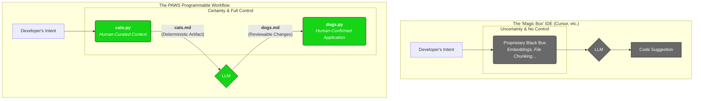

# 🧶🐈 PAWS: The Programmable AI Workflow System

**PAWS/SWAP** is not just another AI coding assistant. It is a professional-grade, command-line toolkit for developers who demand **absolute control, perfect reproducibility, and deep integration** into their own custom workflows. It is built on a simple, powerful philosophy: **the developer, not the AI, must be the orchestrator.**

This repository contains parallel implementations in **Python** and **Node.js**, offering feature parity for developers in both ecosystems.

## The Problem: The Limits of "Magic" AI

Current AI tools like **Cursor, GitHub Copilot, and Windsurf** are powerful, but they operate as "magic boxes." They use opaque, automatic context-gathering that you cannot inspect or control. This leads to frustratingly common failure modes:

- The AI misses critical context from a file you don't have open.
- The AI gets confused by irrelevant code in your active editor.
- The workflow is ephemeral and cannot be reliably reproduced or audited.
- You are forced into a "golden cage"—a specific IDE that dictates your entire workflow.

These tools trade control for convenience, but for serious engineering, that trade-off is unacceptable.

## The PAWS Solution: You Are the Orchestrator

PAWS inverts this paradigm. It provides the unopinionated, composable components for you to design and execute AI-powered workflows with surgical precision. **Being disconnected from a specific editor is its greatest strength.**



With PAWS, you achieve what other tools cannot:

1.  **Explicit Context Control:** You specify exactly what the AI sees using file paths, glob patterns, and powerful `CATSCAN.md` summaries. No more guessing.
2.  **Perfect Reproducibility:** The `cats.md` and `dogs.md` bundles are deterministic text artifacts. You can commit them to Git, share them, and re-run them, ensuring every AI-driven change is auditable and repeatable.
3.  **Total Workflow Composability:** As a CLI tool, PAWS integrates with anything. Use it in VS Code tasks, Neovim plugins, CI/CD pipelines, or simple shell scripts. You build the workflow; PAWS provides the power.
4.  **Extreme Token Efficiency:** Why pay for an AI to read thousands of lines of a library's implementation when all you need is its API? With `CATSCAN.md` summaries, you can slash token usage and costs while increasing accuracy.

## Core Features

- **Granular Context Curation:** Use path prefixes like `summary:<pattern>` to send a module's high-level `CATSCAN.md` summary instead of its full source.
- **`.pawsignore` Support:** Manage project-wide exclusions with a familiar `.gitignore`-style file.
- **Composable Personas:** Layer multiple `-p <persona>.md` files to construct a bespoke AI mind for any task.
- **CATSCAN Verification:** Use `cats.py --verify` to ensure your high-level summaries are not out-of-sync with your source code. Supports Python, JS, TS, and Dart.
- **Agentic Feedback Loop:** The AI can use the `REQUEST_CONTEXT` command to ask for more information when its context is insufficient, turning failure into a productive dialogue.

## Project Lifecycle Examples

PAWS is not just for one-off changes. It's a partner for the entire lifecycle of your project.

### 1. Project Scaffolding

- **Task:** Create a new Python web server project using Flask, including a Dockerfile, tests, and basic structure.
- **`cats.py` Command:**
  ```bash
  # Use the Scaffolder persona and send it a requirements file.
  python py/cats.py requirements.txt -p personas/scaffolder.md -o scaffold_task.md
  ```
- **Result:** The AI generates a `dogs.md` bundle with multiple new files (`app.py`, `Dockerfile`, `tests/test_app.py`, etc.), creating a complete, ready-to-run project structure in a single, reviewable step.

### 2. Mid-Project Refactoring

- **Task:** Refactor a large data processing module to be more efficient.
- **`cats.py` Command:**
  ```bash
  # Send the full module source, but only summaries of its dependencies.
  python py/cats.py src/data_processing/** 'summary:src/utils/**' 'summary:src/db/**' -p personas/refactor_guru.md -o refactor_task.md
  ```
- **Result:** The AI gets a focused context. It uses delta commands in its `dogs.md` response to make precise changes to the data module, which you can review and apply with confidence. If it needs more info on a utility function, it can use `REQUEST_CONTEXT` to ask for it.

### 3. Documentation & Maintenance

- **Task:** A key module has undergone significant changes, and its `CATSCAN.md` is now out of date.
- **`cats.py` Commands:**

  ```bash
  # First, verify the drift.
  python py/cats.py --verify src/changed_module/**

  # Next, ask the AI to update the CATSCAN.
  python py/cats.py src/changed_module/** -p personas/docs_updater.md -o update_docs.md
  ```

- **Result:** `cats.py --verify` gives you a precise list of what's out of sync. You then pass the full module source to a specialized persona that reads the code and generates a new, accurate `CATSCAN.md` file, keeping your project's high-level documentation perfectly maintained.

## Getting Started

_(Installation and basic usage instructions for Python and JS would follow here, similar to the original README but updated for new flags.)_

## Advanced Usage: The Agentic Loop

With the `--allow-reinvoke` flag, you can empower the AI to request and automatically receive more context.

1.  The AI determines its context is incomplete.
2.  It generates a `dogs.md` with an `EXECUTE_AND_REINVOKE` command, specifying what it needs.
3.  You run `python py/dogs.py dogs.md --allow-reinvoke`.
4.  After you confirm the command, `dogs.py` runs it, generating a new `cats.md` bundle.
5.  A wrapper script can then automatically re-invoke the AI with the new context, creating a powerful, human-supervised agentic workflow.

This is the future of AI-assisted development—a true partnership where the AI can ask for what it needs, and the developer always has the final say.
