# REPLOID

**Browser-Native Self-Improving AI Agent**

REPLOID is an AI agent that runs entirely in your browser with Recursive Self-Improvement (RSI) capabilities. The agent can create new tools at runtime, modify its own code, and evolve its capabilities without touching the filesystem.

---

## What It Does

REPLOID achieves **Level 2 RSI** (meta-improvement):

- **Level 1**: Agent creates NEW tools at runtime (tool generation)
- **Level 2**: Agent improves its tool creation mechanism itself (meta-recursion)
- **Level 2+**: Agent modifies ANY of its core modules (agent-loop, tool-runner, etc.)

All improvements persist in IndexedDB. The original source files remain unchanged as the "genesis" state.

---

## Quick Start

```bash
# 1. Install dependencies
pnpm install

# 2. Start server (for proxy-based API calls and Ollama)
pnpm start
# Server runs on http://localhost:8000

# 3. Open browser
# Navigate to http://localhost:8000
```

On the boot screen:
1. **Configure model(s)** - Add at least one LLM (Gemini, Claude, GPT, Ollama, or WebLLM)
2. **Enter a goal** - Try one of the example chips:
   - "Create tools to make tools to make tools"
   - "Analyze your own inefficiency patterns and improve yourself"
   - "Build a self-modifying code generation system"
3. **Click "Awaken Agent"** - Watch the agent work

---

## Architecture

```mermaid
graph TB
    subgraph Browser["Browser Runtime"]
        subgraph Substrate["Substrate Layer"]
            Dashboard["Dashboard UI"]
            Widgets["Dynamic Widgets"]
        end

        subgraph Core["Core Modules (8 files)"]
            AgentLoop["agent-loop.js<br/>Cognitive Cycle"]
            ToolRunner["tool-runner.js<br/>Tool Execution"]
            ToolWriter["tool-writer.js<br/>Tool Creation"]
            MetaWriter["meta-tool-writer.js<br/>Meta-Improvement"]
            SubstrateLoader["substrate-loader.js<br/>Code Injection"]
            LLMClient["llm-client.js<br/>Multi-Provider API"]
            VFS["vfs.js<br/>Virtual Filesystem"]
            SubstrateTools["substrate-tools.js<br/>10 Substrate Tools"]
        end

        subgraph Storage["IndexedDB (VFS)"]
            CoreEvolved["/core/*.js<br/>Evolved Modules"]
            ToolsDir["/tools/*.js<br/>Agent-Created Tools"]
            WidgetsDir["/widgets/*.js<br/>UI Components"]
        end
    end

    subgraph Disk["Disk (Genesis)"]
        GenesisSrc["/core/*.js<br/>Original Source"]
    end

    AgentLoop --> ToolRunner
    AgentLoop --> LLMClient
    ToolRunner --> ToolWriter
    ToolRunner --> MetaWriter
    ToolRunner --> SubstrateTools
    SubstrateTools --> SubstrateLoader
    SubstrateLoader --> Substrate

    VFS --> Storage

    GenesisSrc -.First Boot.-> CoreEvolved
    CoreEvolved --> Core
    ToolsDir --> ToolRunner

    style Storage fill:#1a1a1a
    style Core fill:#0a2f2f
    style Substrate fill:#2f0a2f
```



**RSI Process:** Agent reads its code from VFS → analyzes inefficiencies → generates improvements → writes back to VFS → hot-reloads via blob URLs → becomes better version of itself.

---

## Connection Types

REPLOID supports 4 ways to connect to LLMs:

### 1. Browser → Cloud (Direct)
- Browser makes API calls directly to provider
- Requires: User's API key (stored in localStorage)
- Use for: Gemini, OpenAI, Anthropic

### 2. Proxy → Cloud
- Server proxy makes API calls using .env keys
- Requires: Server running, .env configured
- Use for: Hiding API keys, rate limiting

### 3. Browser → Local (WebGPU)
- Browser runs LLM via WebLLM (WebGPU)
- Requires: GPU-capable browser (Chrome/Edge)
- Use for: Offline, privacy, small models (1-3B params)

### 4. Proxy → Local (Ollama)
- Server proxy forwards to local Ollama
- Requires: Ollama installed and running
- Use for: Large local models (7B-120B params)

---

## Built-in Tools (24 total)

The agent starts with these CRUD-organized tools:

**VFS Operations (5 tools):**
- `read_file(path)` - Read file contents
- `write_file(path, content)` - Create or overwrite file
- `update_file(path, content)` - Update existing file (creates backup)
- `delete_file(path)` - Delete file
- `list_files(path)` - List directory contents

**Tool Creation - Level 1 RSI (5 tools):**
- `read_tool(name)` - Read tool source code
- `create_tool(name, code)` - Create new tool at runtime
- `update_tool(name, code)` - Update existing tool (creates backup)
- `delete_tool(name)` - Delete dynamic tool
- `list_tools()` - List all tools

**Meta-Improvement - Level 2 RSI (3 tools):**
- `improve_tool_writer(code)` - Improve the ToolWriter mechanism
- `improve_core_module(module, code)` - Improve ANY core module
- `rollback_tool_writer()` - Undo last improvement

**Substrate Manipulation - Level 3 RSI (10 tools):**
- `load_module(path)` - Import and execute module from VFS
- `load_widget(path, containerId)` - Mount widget in dashboard
- `create_widget(name, html, css, js)` - Create simple DOM widget
- `create_web_component(name, html, css, js)` - Create Web Component with Shadow DOM
- `execute_substrate_code(code)` - Execute arbitrary code in substrate
- `inject_tool(name, code)` - Fast tool injection (bypasses validation)
- `reload_module(path)` - Hot-reload a module
- `unload_module(path)` - Remove module/widget
- `list_loaded_modules()` - List active substrate components
- `load_iframe(path, containerId)` - Load code in sandboxed iframe

**Note:** `get_tool_source(name)` is aliased to `read_tool(name)` for backward compatibility.

---

## Example: Tool Creation Flow

**User Goal:** "Create a tool that adds two numbers"

```
1. Agent Loop → LLM: "How do I create an add_numbers tool?"

2. LLM Response:
   TOOL_CALL: create_tool
   ARGS: {
     "name": "add_numbers",
     "code": "export default async function add_numbers(args) { return args.a + args.b; }"
   }

3. Agent Loop → Tool Runner → Tool Writer:
   - Validates syntax ✓
   - Saves to /tools/add_numbers.js in VFS
   - Loads via blob URL
   - Registers with Tool Runner

4. Agent Loop → Tool Runner → add_numbers:
   execute('add_numbers', {a: 5, b: 3})
   → Result: 8

5. Agent Loop → LLM: "Tool created successfully, result is 8"
```

---

## Example: Meta-Improvement Flow

**User Goal:** "Analyze your tool creation process and optimize it"

```
1. Agent reads current tool-writer:
   read_file('/core/tool-writer.js')

2. Agent analyzes code, identifies bottleneck:
   "Validation is slow, can optimize with AST caching"

3. Agent generates improved version with caching

4. Agent improves itself:
   improve_tool_writer(optimizedCode)

   → Backs up current version
   → Writes new version to VFS
   → Hot-reloads module
   → Re-registers create_tool

5. Future tool creations are now faster
```

---

## Example Goals

### 1. Recursive Tool Generation
**Goal:** "Create tools to make tools to make tools"

The agent creates:
- `tool_generator` - Generates tool code from descriptions
- `meta_tool_generator` - Generates tools that generate tools
- `tool_optimizer` - Improves existing tool performance

### 2. Self-Optimization
**Goal:** "Analyze your own inefficiency patterns and improve yourself"

The agent:
1. Profiles its execution (reads agent-loop.js)
2. Identifies bottlenecks (too many LLM calls?)
3. Generates optimized agent-loop.js
4. Uses `improve_core_module('agent-loop', newCode)`
5. Reloads with improvements

### 3. Code Generation System
**Goal:** "Build a self-modifying code generation system"

The agent:
1. Creates `code_generator` tool
2. Creates `code_analyzer` tool
3. Creates `code_optimizer` tool
4. Uses these tools to improve itself
5. Iterates: generates → analyzes → optimizes → repeat

---

## Configuration

### .env File (for server proxy)

```bash
GEMINI_API_KEY=your_key_here
ANTHROPIC_API_KEY=your_key_here
OPENAI_API_KEY=your_key_here
```

### Model Configuration (in browser)

On boot screen:
1. Click "+ Add Model"
2. Select provider (Gemini, Claude, OpenAI, Ollama, WebLLM)
3. Choose connection type (browser-cloud, proxy-cloud, browser-local, proxy-local)
4. Enter API key if browser-cloud
5. Add up to 4 models

The agent can use multiple models (consensus mode, fallback, etc.)

---

## Development

### Project Structure

- **Core modules**: `/core/*.js` - ES6 modules with factory pattern
- **Boot screen**: `/boot/*.js` - Model selection and configuration
- **Server**: `/server/proxy.js` - Express server for proxy connections
- **Genesis state**: Core modules on disk are read-only reference

### Adding a New Core Module

1. Create `/core/new-module.js`:
```javascript
const NewModule = {
  metadata: { name: 'NewModule', version: '1.0.0' },
  factory: (deps) => {
    return {
      // your API here
    };
  }
};
export default NewModule;
```

2. Update `boot.js` to load it during Genesis

3. Clear cache and reload to test

### Hot-Reloading Modules

The agent can hot-reload modules at runtime:
```javascript
// 1. Read new code
const newCode = generateImprovedCode();

// 2. Write to VFS
await vfs.write('/core/module.js', newCode);

// 3. Create blob URL and import
const blob = new Blob([newCode], { type: 'text/javascript' });
const url = URL.createObjectURL(blob);
const module = await import(url);
URL.revokeObjectURL(url);

// 4. Replace in DI container / re-register
```

---

## Technical Details

### VFS Implementation
- **Storage**: IndexedDB (via simple-vfs.js)
- **Not Git-based**: Removed LightningFS + isomorphic-git (too heavy)
- **Operations**: read, write, list, delete, snapshot, restore
- **Persistence**: Survives page refreshes
- **Reset**: "Clear Cache" button wipes IndexedDB

### Module Loading
- **Genesis**: Fetch from disk → write to VFS
- **Runtime**: Read from VFS → create blob URL → import as ES module
- **Hot-reload**: Replace blob URL, re-initialize factory
- **No eval()**: Uses native ES module imports via blob URLs

### Agent Loop
- **System prompt**: Includes list of all tools and RSI capabilities
- **Tool calling format**: `TOOL_CALL: name` + `ARGS: {...}`
- **Context management**: Conversation history with tool results
- **Termination**: Agent responds with `DONE: ...`

### Security
- **Sandboxing**: Tool code validated before execution
- **No arbitrary code**: Tool Writer checks syntax and structure
- **Rollback**: Failed improvements automatically rolled back
- **Backups**: All improvements saved with timestamps

---

## Limitations

- **Browser-only**: No Node.js backend required (except optional proxy)
- **Storage limits**: IndexedDB typically 50MB-unlimited depending on browser
- **WebLLM models**: Limited to 1-3B params due to VRAM constraints
- **Streaming**: Not yet implemented (planned)
- **Multi-model consensus**: Basic implementation, can be improved by agent

---

## Troubleshooting

### Boot fails with module errors
- Click "Clear Cache" button
- Check browser console for errors
- Verify all files in `/core/` exist

### Agent doesn't respond
- Check model is selected and configured
- Verify API key is correct (browser console)
- Check network tab for failed requests

### VFS is empty after genesis
- Check browser console for fetch errors
- Verify `/core/*.js` files exist on disk

### Tool creation fails
- Check tool code syntax
- Must be: `export default async function name(args) { ... }`
- Check browser console for validation errors

---

## Philosophy

REPLOID is an experiment in **substrate-independent RSI**:

- The agent's "brain" is just data in IndexedDB
- The agent can modify this data (its own code)
- The original source code (genesis) is the evolutionary starting point
- Every agent instance can evolve differently

This is analogous to:
- **DNA** = source code on disk (genesis)
- **Organism** = runtime state in IndexedDB (evolved)
- **Mutations** = agent self-modifications
- **Fitness** = agent-measured improvements (faster, better, etc.)

---

## License

MIT

---

## Contributing

REPLOID is designed to be extended by the agent itself. Try goals like:

- "Add streaming support to llm-client.js"
- "Implement multi-model consensus in agent-loop.js"
- "Create a tool to visualize your execution trace"
- "Add caching to tool-runner.js to speed up repeated calls"

The agent should be able to implement these improvements autonomously.
