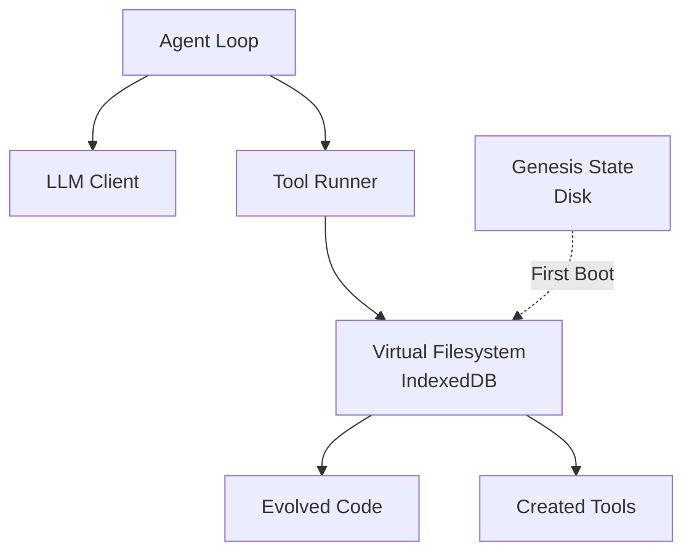

# REPLOID

**R**ecursive **E**volution **P**rotocol **L**oop **O**ptimizing **I**ntelligent [**D**REAMER](https://github.com/clocksmith/paws/edit/main/reploid/README.md)
(**D**ynamic **R**ecursive **E**ngine **A**dapting **M**odules **E**volving [**R**EPLOID](https://github.com/clocksmith/paws/edit/main/reploid/README.md)
→ REPLOID ↔ DREAMER ↔ ∞

A browser-native AI agent with [Recursive Self-Improvement (RSI)](https://en.wikipedia.org/wiki/Recursive_self-improvement) capabilities . 

REPLOID runs entirely in your browser, creating new tools at runtime and modifying its own code to evolve its capabilities.

**RSI Levels:**
- **Level 1**: Creates new tools at runtime
- **Level 2**: Improves its tool creation mechanism
- **Level 3+**: Modifies any core module (agent-loop, tool-runner, etc.)

All improvements persist in IndexedDB while original source files remain unchanged as the "genesis" state.

---

## Architecture



**How it works:** Agent reads code from VFS → analyzes & improves → writes back to VFS → hot-reloads → becomes better.

---

## Core Modules

REPLOID consists of 11 core modules that can all be modified by the agent at runtime:

**Cognitive Layer:**
- `agent-loop.js` - Main cognitive cycle and decision-making
- `llm-client.js` - Multi-provider LLM communication
- `multi-model-coordinator.js` - Orchestrates multiple models
- `workflow-manager.js` - Manages complex multi-step workflows

**Tool Layer:**
- `tool-runner.js` - Executes tools and manages tool registry
- `tool-writer.js` - Creates and validates new tools (Level 1 RSI)
- `meta-tool-writer.js` - Improves core modules (Level 2+ RSI)

**Substrate Layer:**
- `substrate-loader.js` - Hot-loads evolved code as living modules
- `substrate-tools.js` - Provides 10 substrate manipulation tools

**Foundation:**
- `vfs.js` - Virtual filesystem (IndexedDB)
- `utils.js` - Shared utilities

All modules use a factory pattern and can be read, modified, and hot-reloaded by the agent using `improve_core_module()`.

---

## Connection Types

REPLOID supports 4 ways to connect to LLMs:

### 1. Browser → Cloud (Direct)
- Browser makes API calls directly to provider
- Requires: User's API key (stored in localStorage)
- Use for: Gemini, OpenAI, Anthropic

### 2. Proxy → Cloud
- Server proxy makes API calls using .env keys
- Requires: Server running, .env configured
- Use for: Hiding API keys, rate limiting

### 3. Browser → Local (WebGPU)
- Browser runs LLM via WebLLM (WebGPU)
- Requires: GPU-capable browser (Chrome/Edge)
- Use for: Offline, privacy, small models (1-3B params)

### 4. Proxy → Local (Ollama)
- Server proxy forwards to local Ollama
- Requires: Ollama installed and running
- Use for: Large local models (7B-120B params)

---

## Built-in Tiered Tools (24 total)

The agent starts with these CRUD-organized tools:

**VFS Operations (5 tools):**
- `read_file(path)` - Read file contents
- `write_file(path, content)` - Create or overwrite file
- `update_file(path, content)` - Update existing file (creates backup)
- `delete_file(path)` - Delete file
- `list_files(path)` - List directory contents

**Tool Creation - Level 1 RSI (5 tools):**
- `read_tool(name)` - Read tool source code
- `create_tool(name, code)` - Create new tool at runtime
- `update_tool(name, code)` - Update existing tool (creates backup)
- `delete_tool(name)` - Delete dynamic tool
- `list_tools()` - List all tools

**Meta-Improvement - Level 2 RSI (3 tools):**
- `improve_tool_writer(code)` - Improve the ToolWriter mechanism
- `improve_core_module(module, code)` - Improve ANY core module
- `rollback_tool_writer()` - Undo last improvement

**Substrate Manipulation - Level 3 RSI (10 tools):**
- `load_module(path)` - Import and execute module from VFS
- `load_widget(path, containerId)` - Mount widget in dashboard
- `create_widget(name, html, css, js)` - Create simple DOM widget
- `create_web_component(name, html, css, js)` - Create Web Component with Shadow DOM
- `execute_substrate_code(code)` - Execute arbitrary code in substrate
- `inject_tool(name, code)` - Fast tool injection (bypasses validation)
- `reload_module(path)` - Hot-reload a module
- `unload_module(path)` - Remove module/widget
- `list_loaded_modules()` - List active substrate components
- `load_iframe(path, containerId)` - Load code in sandboxed iframe

**Note:** `get_tool_source(name)` is aliased to `read_tool(name)` for backward compatibility.

---

## Examples

### 1. Tool Creation (Level 1 RSI)
**Goal:** "Create a tool that adds two numbers"

The agent might:
1. Use LLM to generate tool code: `create_tool('add_numbers', code)`
2. Tool Writer validates syntax and saves to `/tools/add_numbers.js` in VFS
3. Tool is loaded via blob URL and registered with Tool Runner
4. Execute the new tool: `add_numbers({a: 5, b: 3})` → Result: 8
5. Tool is now available for future use

### 2. Meta-Improvement (Level 2 RSI)
**Goal:** "Analyze your tool creation process and optimize it"

The agent might:
1. Read current tool-writer: `read_file('/core/tool-writer.js')`
2. Analyze code and identify bottleneck (e.g., "Validation is slow")
3. Generate improved version with AST caching
4. Improve itself: `improve_tool_writer(optimizedCode)`
5. Module backs up, hot-reloads, and future tool creations are faster

### 3. Recursive Self-Improvement (Level 2+)
**Goal:** "Build a self-modifying code generation system"

The agent might:
1. Create `code_generator` tool for generating new code
2. Create `code_analyzer` tool for profiling execution
3. Create `code_optimizer` tool for improving performance
4. Use `improve_core_module('agent-loop', newCode)` to enhance its own cognitive loop
5. Iterate: generates → analyzes → optimizes → improves itself → repeat

---

## Configuration

### .env File (optional, for server proxy)

```bash
GEMINI_API_KEY=your_key_here
ANTHROPIC_API_KEY=your_key_here
OPENAI_API_KEY=your_key_here
```

### Model Configuration (in browser)

On boot screen:

1. Click "+ Add Model"
2. Select provider (Gemini, Claude, OpenAI, Ollama, WebLLM)
3. Choose connection type (browser-cloud, proxy-cloud, browser-local, proxy-local)
4. Enter API key if browser-cloud
5. Add up to 4 models

The agent can use multiple models (consensus mode, fallback, etc.)

---

## Technical Overview

### VFS Implementation
- **Storage**: IndexedDB (via simple-vfs.js)
- **Operations**: read, write, list, delete, snapshot, restore
- **Persistence**: Survives page refreshes
- **Reset**: "Clear Cache" button wipes IndexedDB

### Module Loading
- **Genesis**: Fetch from disk → write to VFS
- **Runtime**: Read from VFS → create blob URL → import as ES module
- **Hot-reload**: Replace blob URL, re-initialize factory

### Agent Loop
- **System prompt**: Includes list of all tools and RSI capabilities
- **Tool calling format**: `TOOL_CALL: name` + `ARGS: {...}`
- **Context management**: Conversation history and compaction with tool results

### Security
- **Rollback**: Failed improvements automatically rolled back
- **Sandboxing** Can only access local non-browser resources through a secure proxy
- **No eval()**: Uses native ES module imports via blob URLs

---

## Limitations

- **Browser-only**: No Node.js backend required (except optional proxy)
- **Storage limits**: IndexedDB typically ~50MB, but could be unlimited depending on browser
- **WebLLM models**: Limited to 1-3B params due to VRAM usage allowed by browser constraints
- **Multi-model consensus**: Basic implementation, can be improved by agent

---

## Philosophy

REPLOID is an experiment in [**substrate-independent](https://www.edge.org/response-detail/27126) RSI**:

- The agent's "brain" is just data in IndexedDB
- The agent can modify this data (its own code)
- The original source code (genesis) is the evolutionary starting point
- Every agent instance can evolve differently

This is analogous to:
- **DNA** = source code on disk (genesis)
- **Organism** = runtime state in IndexedDB (evolved)
- **Mutations** = agent self-modifications
- **Fitness** = agent-measured improvements (faster, better, etc.)

---

## License

MIT

